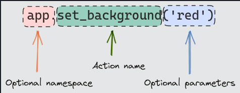

# Actions

- Actions are allow-listed functions with a string syntax you can embed in links and bind to keys. In this chapter we will discuss how to create actions and how to run them.

## Action methods

- Action methods are methods on your app or widgets prefixed with `action_`. Aside from the prefix these are regular methods which you could call directly if you wished.

- Action methods may be coroutines (defined with the `async` keyword).

- [`actions01.py`](actions01.py)

- Action strings have the following format:

    - The name of an action on its own will call the action method with no parameters. For example, an action string of `bell` will call `action_bell()`.
    - Action strings may be followed by parenthesis containing Python objects. For example, the action string set_background("red") will call action_set_background("red").
    - Action strings may be prefixed with a namespace (see below) and a dot.

- [`actions02.py`](actions02.py)

## Links

- Actions may be embedded as links within console markup. You can create such links with a `@click` tag.

- [`actions03.py`](actions03.py)

## Bindings

- Textual will run actions bound to keys. The following example adds key bindings for the `R`, `G`, and `B` keys which call the `set_background` action.

- [`actions03.py`](actions03.py)

## Namespaces

- Textual will look for action methods in the class where they are defined (`App`, `Screen`, or `Widget`). If we were to create a custom widget it can have its own set of actions.

- [`actions05.py`](actions05.py)

## Dynamic actions

- There may be situations where an action is temporarily unavailable due to some internal state within your app. For instance, consider an app with a fixed number of pages and actions to go to the next and previous page. It doesn't make sense to go to the previous page if we are on the first, or the next page when we are on the last page.

- We could easily add this logic to the action methods, but the `footer` would still display the keys even if they would have no effect. The user may wonder why the app is showing keys that don't appear to work.

- We can solve this issue by implementing the `check_action` on our app, screen, or widget. This method is called with the name of the action and any parameters, prior to running actions or refreshing the `footer`. It should return one of the following values:

    - `True` to show the key and run the action as normal.
    - `False` to hide the key and prevent the action running.
    - `None` to disable the key (show dimmed), and prevent the action running.

## Builtin actions