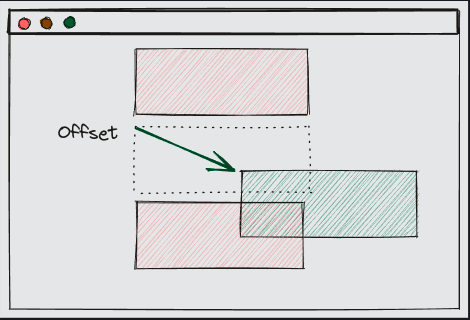

# Layout

- The `layout` defines how widgets will be arranged (or laid out) inside a container. Textual supports a number of layouts which can be set either via a widget's `styles` object or via CSS.

- Layouts can be used for both high-level positioning of widgets on screen, and for positioning of nested widgets.

## Vertical

- The `vertical` layout arranges child widgets vertically, from top to bottom.

    

- `vertical_layout.py`

    ```python
    from textual.app import App, ComposeResult
    from textual.widgets import Static


    class VerticalLayoutExample(App):
        CSS_PATH = "vertical_layout.tcss"

        def compose(self) -> ComposeResult:
            yield Static("One", classes="box")
            yield Static("Two", classes="box")
            yield Static("Three", classes="box")


    if __name__ == "__main__":
        app = VerticalLayoutExample()
        app.run()
    ```

- `vertical_layout.tcss`

    ```css
    Screen {
        layout: vertical;
    }

    .box {
        height: 1fr;
        border: solid green;
    }
    ```

## Horizontal

- The `horizontal` layout arranges child widgets horizontally, from left to right.

    


- `horizontal_layout.py`

    ```python
    from textual.app import App, ComposeResult
    from textual.widgets import Static


    class HorizontalLayoutExample(App):
        CSS_PATH = "horizontal_layout.tcss"

        def compose(self) -> ComposeResult:
            yield Static("One", classes="box")
            yield Static("Two", classes="box")
            yield Static("Three", classes="box")


    if __name__ == "__main__":
        app = HorizontalLayoutExample()
        app.run()
    ```

- `horizontal_layout.tcss`

    ```css
    Screen {
        layout: horizontal;
    }

    .box {
        height: 100%;
        width: 1fr;
        border: solid green;
    }
    ```

- If we remove the width restriction from the above example (by deleting `width: 1fr;`), each child widget will grow to fit the width of the screen, and only the first widget will be visible. The other two widgets in our layout are offscreen, to the right-hand side of the screen. In the case of horizontal layout, Textual will not automatically add a scrollbar.

- To enable horizontal scrolling, we can use the `overflow-x: auto;` declaration:

- `horizontal_layout_overflow.tcss`

    ```css
    Screen {
        layout: horizontal;
        overflow-x: auto;
    }

    .box {
        height: 100%;
        border: solid green;
    }
    ```

## Grid

- The `grid` layout arranges widgets within a grid. Widgets can span multiple rows and columns to create complex layouts. The diagram below hints at what can be achieved using `layout: grid`.

    

- `grid_layout1.py`

    ```python
    from textual.app import App, ComposeResult
    from textual.widgets import Static


    class GridLayoutExample(App):
        CSS_PATH = "grid_layout1.tcss"

        def compose(self) -> ComposeResult:
            yield Static("One", classes="box")
            yield Static("Two", classes="box")
            yield Static("Three", classes="box")
            yield Static("Four", classes="box")
            yield Static("Five", classes="box")
            yield Static("Six", classes="box")


    if __name__ == "__main__":
        app = GridLayoutExample()
        app.run()
    ```

- `grid_layout1.tcss`

    ```css
    Screen {
        layout: grid;
        grid-size: 3 2;
    }

    .box {
        height: 100%;
        border: solid green;
    }
    ```

### Row and column sizes

- You can adjust the width of columns and the height of rows in your grid using the `grid-columns` and `grid-rows` properties. These properties can take multiple values, letting you specify dimensions on a column-by-column or row-by-row basis.

- `grid_layout2.py`

    ```python
    from textual.app import App, ComposeResult
    from textual.widgets import Static


    class GridLayoutExample(App):
        CSS_PATH = "grid_layout2.tcss"

        def compose(self) -> ComposeResult:
            yield Static("One", classes="box")
            yield Static("Two", classes="box")
            yield Static("Three", classes="box")
            yield Static("Four", classes="box")
            yield Static("Five", classes="box")
            yield Static("Six", classes="box")


    if __name__ == "__main__":
        app = GridLayoutExample()
        app.run()
    ```

- `grid_layout2.tcss`

    ```css
    Screen {
        layout: grid;
        grid-size: 3;
        grid-columns: 2fr 1fr 1fr;
    }

    .box {
        height: 100%;
        border: solid green;
    }
    ```

### Auto rows / columns

- The `grid-columns` and `grid-rows` rules can both accept a value of `auto` in place of any of the dimensions, which tells Textual to calculate an optimal size based on the content.

- `grid_layout3.py`

    ```python
    from textual.app import App, ComposeResult
    from textual.widgets import Static


    class GridLayoutExample(App):
        CSS_PATH = "grid_layout3.tcss"

        def compose(self) -> ComposeResult:
            yield Static("One", classes="box")
            yield Static("Two", classes="box")
            yield Static("Three", classes="box")
            yield Static("Four", classes="box")
            yield Static("Five", classes="box")
            yield Static("Six", classes="box")


    if __name__ == "__main__":
        app = GridLayoutExample()
        app.run()
    ```

- `grid_layout3.tcss`

    ```css
    Screen {
        layout: grid;
        grid-size: 3;
        grid-columns: auto 1fr 1fr;
    }

    .box {
        height: 100%;
        border: solid green;
    }
    ```

### Cell spans

- Cells may span multiple rows or columns, to create more interesting grid arrangements.

- `grid_layout4.py`

    ```python
    from textual.app import App, ComposeResult
    from textual.widgets import Static


    class GridLayoutExample(App):
        CSS_PATH = "grid_layout6_row_span.tcss"

        def compose(self) -> ComposeResult:
            yield Static("One", classes="box")
            yield Static("Two [b](column-span: 2 and row-span: 2)", classes="box", id="two")
            yield Static("Three", classes="box")
            yield Static("Four", classes="box")
            yield Static("Five", classes="box")
            yield Static("Six", classes="box")


    app = GridLayoutExample()
    if __name__ == "__main__":
        app.run()
    ```

- `grid_layout4.tcss`

    ```css
    Screen {
        layout: grid;
        grid-size: 3;
    }

    #two {
        column-span: 2;
        row-span: 2;
        tint: magenta 40%;
    }

    .box {
        height: 100%;
        border: solid green;
    }
    ```

### Gutter

- The spacing between cells in the grid can be adjusted using the `grid-gutter` CSS property. By default, cells have no gutter, meaning their edges touch each other. Gutter is applied across every cell in the grid, so `grid-gutter` must be used on a widget with `layout: grid` (not on a child/cell widget).

- `grid_layout5.py`

    ```python
    from textual.app import App, ComposeResult
    from textual.widgets import Static


    class GridLayoutExample(App):
        CSS_PATH = "grid_layout5_gutter.tcss"

        def compose(self) -> ComposeResult:
            yield Static("One", classes="box")
            yield Static("Two", classes="box")
            yield Static("Three", classes="box")
            yield Static("Four", classes="box")
            yield Static("Five", classes="box")
            yield Static("Six", classes="box")


    if __name__ == "__main__":
        app = GridLayoutExample()
        app.run()
    ```

- `grid_layout5.tcss`

    ```css
    Screen {
        layout: grid;
        grid-size: 3;
        grid-gutter: 1;
        background: lightgreen;
    }

    .box {
        background: darkmagenta;
        height: 100%;
    }
    ```

## Docking¶

- Widgets may be docked. Docking a widget removes it from the layout and fixes its position, aligned to either the `top`, `right`, `bottom`, or `left` edges of a container. Docked widgets will not scroll out of view, making them ideal for `sticky headers`, `footers`, and `sidebars`.

    

- To dock a widget to an edge, add a `dock: <EDGE>;` declaration to it, where `<EDGE>` is one of `top`, `right`, `bottom`, or `left`. For example, a sidebar similar to that shown in the diagram above can be achieved using `dock: left;`. The code below shows a simple sidebar implementation.

- `docker_layout1_sidebar.py`

    ```python
    from textual.app import App, ComposeResult
    from textual.widgets import Static

    TEXT = """\
    Docking a widget removes it from the layout and fixes its position, aligned to either the top, right, bottom, or left edges of a container.

    Docked widgets will not scroll out of view, making them ideal for sticky headers, footers, and sidebars.

    """


    class DockLayoutExample(App):
        CSS_PATH = "dock_layout1_sidebar.tcss"

        def compose(self) -> ComposeResult:
            yield Static("Sidebar", id="sidebar")
            yield Static(TEXT * 10, id="body")


    if __name__ == "__main__":
        app = DockLayoutExample()
        app.run()
    ```

- `docker_layout1_sidebar.tcss`

    ```css
    #sidebar {
        dock: left;
        width: 15;
        height: 100%;
        color: #0f2b41;
        background: dodgerblue;
    }
    ```

## Layers

- Textual has a concept of layers which gives you finely grained control over the order widgets are placed.

- When drawing widgets, Textual will first draw on lower layers, working its way up to higher layers. As such, widgets on higher layers will be drawn on top of those on lower layers.

    

- `layers.py`

    ```python
    from textual.app import App, ComposeResult
    from textual.widgets import Static


    class LayersExample(App):
        CSS_PATH = "layers.tcss"

        def compose(self) -> ComposeResult:
            yield Static("box1 (layer = above)", id="box1")
            yield Static("box2 (layer = below)", id="box2")


    if __name__ == "__main__":
        app = LayersExample()
        app.run()
    ```

- `layers.tcss`

    ```css
    Screen {
        align: center middle;
        layers: below above;
    }

    Static {
        width: 28;
        height: 8;
        color: auto;
        content-align: center middle;
    }

    #box1 {
        layer: above;
        background: darkcyan;
    }

    #box2 {
        layer: below;
        background: orange;
        offset: 12 6;
    }
    ```

## Offsets

- Widgets have a relative offset which is added to the widget's location, after its location has been determined via its parent's layout. This means that if a widget hasn't had its offset modified using CSS or Python code, it will have an offset of `(0, 0)`.

    

- The offset of a widget can be set using the `offset` CSS property. `offset` takes two values.

- The first value defines the `x` (horizontal) offset. Positive values will shift the widget to the right. Negative values will shift the widget to the left.

- The second value defines the `y` (vertical) offset. Positive values will shift the widget down. Negative values will shift the widget up.

### [Putting it all together](combining_layouts.py)


