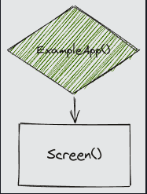
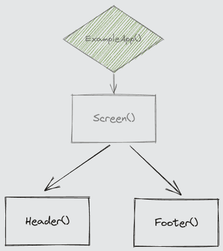
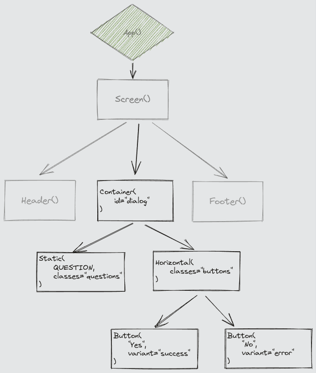
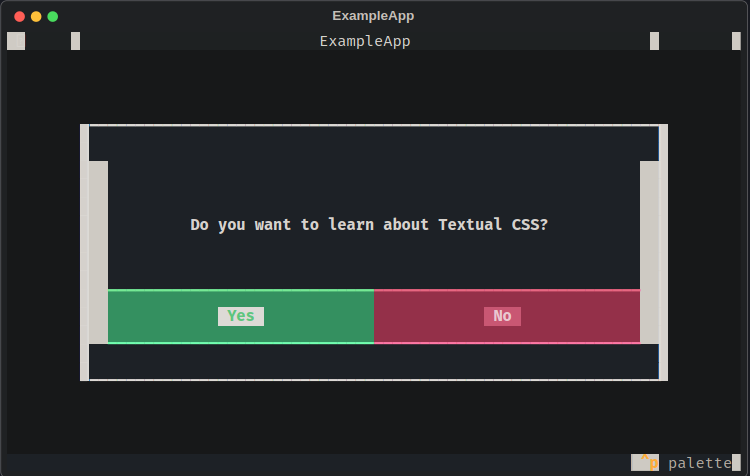
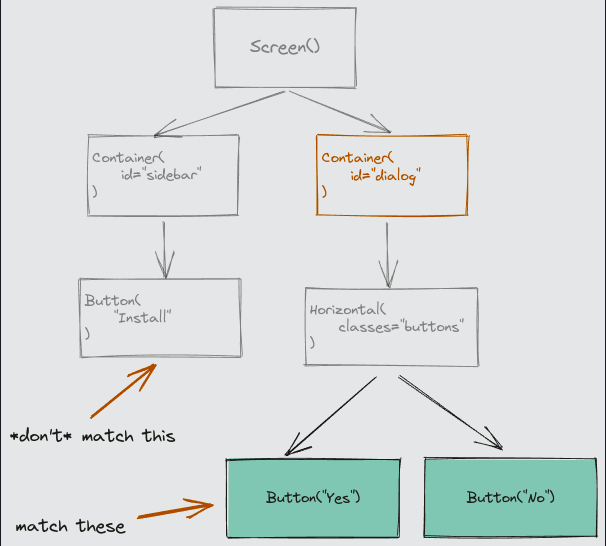
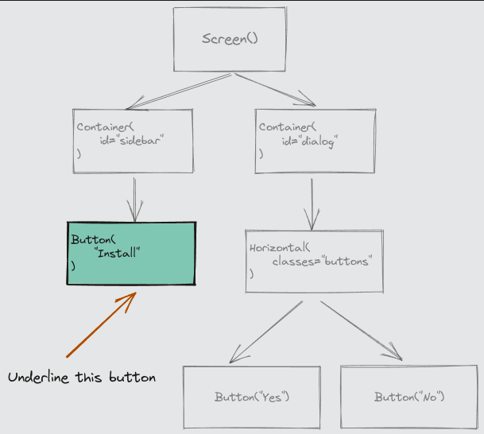
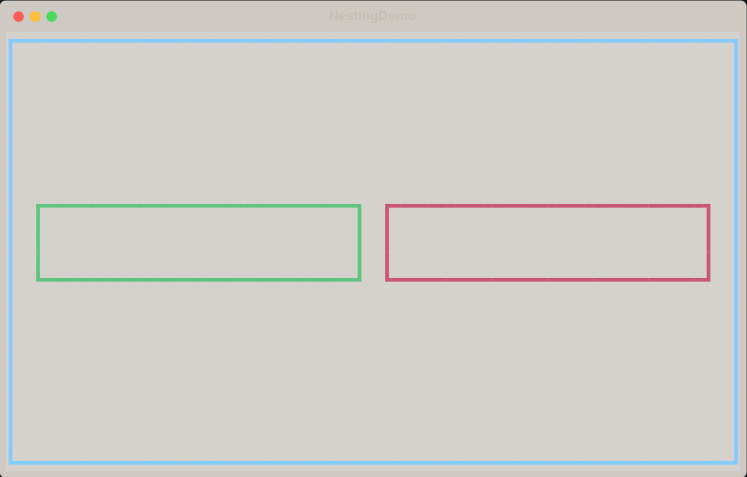

# Textual CSS¶

## Stylesheets

- CSS stands for Cascading Stylesheet. A stylesheet is a list of styles and rules about how those styles should be applied to a web page. In the case of Textual, the stylesheet applies styles to widgets, but otherwise it is the same idea.

- Example:

    ```css
    Header {
        dock: top;
        height: 3;
        content-align: center middle;
        background: blue;
        color: white;
    }
    ```

## The DOM

- The DOM, or Document Object Model, is a term borrowed from the web world. In Textual CSS, the DOM is an arrangement of widgets you can visualize as a tree-like structure.

- `dom1.py`

    ```python
    from textual.app import App


    class ExampleApp(App):
        pass


    if __name__ == "__main__":
        app = ExampleApp()
        app.run()
    ```

    

- `dom2.py`

    ```python
    from textual.app import App, ComposeResult
    from textual.widgets import Header, Footer


    class ExampleApp(App):
        def compose(self) -> ComposeResult:
            yield Header()
            yield Footer()


    if __name__ == "__main__":
        app = ExampleApp()
        app.run()
    ```

    

- `dom3.py`

    ```python
    from textual.app import App, ComposeResult
    from textual.containers import Container, Horizontal
    from textual.widgets import Button, Footer, Header, Static

    QUESTION = "Do you want to learn about Textual CSS?"


    class ExampleApp(App):
        def compose(self) -> ComposeResult:
            yield Header()
            yield Footer()
            yield Container(
                Static(QUESTION, classes="question"),
                Horizontal(
                    Button("Yes", variant="success"),
                    Button("No", variant="error"),
                    classes="buttons",
                ),
                id="dialog",
            )


    if __name__ == "__main__":
        app = ExampleApp()
        app.run()
    ```

    

- `dom4.py`

    ```python
    from textual.app import App, ComposeResult
    from textual.containers import Container, Horizontal
    from textual.widgets import Button, Footer, Header, Static

    QUESTION = "Do you want to learn about Textual CSS?"


    class ExampleApp(App):
        CSS_PATH = "dom4.tcss"

        def compose(self) -> ComposeResult:
            yield Header()
            yield Footer()
            yield Container(
                Static(QUESTION, classes="question"),
                Horizontal(
                    Button("Yes", variant="success"),
                    Button("No", variant="error"),
                    classes="buttons",
                ),
                id="dialog",
            )


    if __name__ == "__main__":
        app = ExampleApp()
        app.run()
    ```

- `dom4.tcss`

    ```css
    /* The top level dialog (a Container) */
    #dialog {
        height: 100%;
        margin: 4 8;
        background: $panel;
        color: $text;
        border: tall $background;
        padding: 1 2;
    }

    /* The button class */
    Button {
        width: 1fr;
    }

    /* Matches the question text */
    .question {
        text-style: bold;
        height: 100%;
        content-align: center middle;
    }

    /* Matches the button container */
    .buttons {
        width: 100%;
        height: auto;
        dock: bottom;
    }
    ```


    

## Selectors

### Type selector

- The type selector matches the name of the (Python) class. Consider the following widget class:

    ```python
    from textual.widgets import Static

    class Alert(Static):
        pass
    ```

    ```css
    Alert {
        border: solid red;
    }
    ```

    ```css
    Static {
        background: blue;
        border: rounded green;
    }
    ```

### ID selector

- Every Widget can have a single id attribute, which is set via the constructor. The ID should be unique to its container.

    ```python
    yield Button(id="next")
    ```

    ```css
    #next {
        outline: red;
    }
    ```

### Class-name selector

- Every widget can have a number of class names applied. The term "class" here is borrowed from web CSS, and has a different meaning to a Python class. You can think of a CSS class as a tag of sorts. Widgets with the same tag will share styles.

    ```python
    yield Button(classes="success")
    yield Button(classes="error disabled")
    ```

    ```css
    .success {
        background: green;
        color: white;
    }

    .error.disabled {
        background: darkred;
    }
    ```

- Unlike the `id` attribute, a widget's classes can be changed after the widget was created. Adding and removing CSS classes is the recommended way of changing the display while your app is running. There are a few methods you can use to manage CSS classes.

    - `add_class()` Adds one or more classes to a widget.
    - `remove_class()` Removes class name(s) from a widget.
    - `toggle_class()` Removes a class name if it is present, or adds the name if it's not already present.
    - `has_class()` Checks if one or more classes are set on a widget.
    - `classes` Is a frozen set of the class(es) set on a widget.

### Universal selector

- The universal selector is denoted by an asterisk and will match all widgets.

    ```css
    * {
        outline: solid red;
    }
    ```

### Pseudo classes

- Pseudo classes can be used to match widgets in a particular state. Pseudo classes are set automatically by Textual. For instance, you might want a button to have a green background when the mouse cursor moves over it. We can do this with the `:hover` pseudo selector.

    ```css
    Button:hover {
        background: green;
    }
    ```

- The `background: green` is only applied to the Button underneath the mouse cursor. When you move the cursor away from the button it will return to its previous background color.

- Here are some other pseudo classes:

    - `:blur` Matches widgets which do not have input focus.

    - `:focus` Matches widgets which have input focus.

    - `:focus-within` Matches widgets with a focused child widget.

    - `:dark` Matches widgets in dark mode (where App.dark == True).

    - `:light` Matches widgets in dark mode (where App.dark == False).

    - `:disabled` Matches widgets which are in a disabled state.

    - `:enabled` Matches widgets which are in an enabled state.

    - `:even` Matches a widget at an evenly numbered position within its siblings.

    - `:odd` Matches a widget at an oddly numbered position within its siblings.

    - `:first-of-type` Matches a widget that is the first of its type amongst its siblings.

    - `:last-of-type` Matches a widget that is the last of its type amongst its siblings.

    - `:inline` Matches widgets when the app is running in inline mode.

## Combinators

### Descendant combinator

- If you separate two selectors with a space it will match widgets with the second selector that have an ancestor that matches the first selector.

    ```css
    #dialog Button {
        text-style: bold;
    }

    #dialog Horizontal Button {
        text-style: bold;
    }
    ```

    

### Child combinator

- The child combinator is similar to the descendant combinator but will only match an immediate child. To create a child combinator, separate two selectors with a greater than symbol (`>`). Any whitespace around the `>` will be ignored.

    ```css
    #sidebar > Button {
        text-style: underline;
    }
    ```

    

### Important rules

- The specificity rules are usually enough to fix any conflicts in your stylesheets. There is one last way of resolving conflicting selectors which applies to individual rules. If you add the text `!important` to the end of a rule then it will "win" regardless of the specificity.

    ```css
    Button:hover {
        background: blue !important;
    }
    ```

### CSS Variables

- You can define variables to reduce repetition and encourage consistency in your CSS. Variables in Textual CSS are prefixed with `$`. Here's an example of how you might define a variable called `$border`:

    ```css
    $border: wide green;

    #foo {
        border: $border;
    }

    /* Translated to:
    #foo {
        border: $border;
    }
    */
    ```

### Nesting CSS

- `nesting01.py`

    ```python
    from textual.app import App, ComposeResult
    from textual.containers import Horizontal
    from textual.widgets import Static


    class NestingDemo(App):
        """App that doesn't have nested CSS."""

        CSS_PATH = "nesting01.tcss"

        def compose(self) -> ComposeResult:
            with Horizontal(id="questions"):
                yield Static("Yes", classes="button affirmative")
                yield Static("No", classes="button negative")


    if __name__ == "__main__":
        app = NestingDemo()
        app.run()
    ```

- `nesting01.tcss`

    ```css
    /* Style the container */
    #questions {
        border: heavy $primary;
        align: center middle;
    }

    /* Style all buttons */
    #questions .button {
        width: 1fr;
        padding: 1 2;
        margin: 1 2;
        text-align: center;
        border: heavy $panel;
    }

    /* Style the Yes button */
    #questions .button.affirmative {
        border: heavy $success;
    }

    /* Style the No button */
    #questions .button.negative {
        border: heavy $error;
    }
    ```

    

- `nesting02.py`

    ```python
    from textual.app import App, ComposeResult
    from textual.containers import Horizontal
    from textual.widgets import Static


    class NestingDemo(App):
        """App that doesn't have nested CSS."""

        CSS_PATH = "nesting02.tcss"

        def compose(self) -> ComposeResult:
            with Horizontal(id="questions"):
                yield Static("Yes", classes="button affirmative")
                yield Static("No", classes="button negative")


    if __name__ == "__main__":
        app = NestingDemo()
        app.run()
    ```

- `nesting02.tcss`

    ```css
    /* Style the container */
    #questions {
        border: heavy $primary;
        align: center middle;

        /* Style all buttons */
        .button {
            width: 1fr;
            padding: 1 2;
            margin: 1 2;
            text-align: center;
            border: heavy $panel;

            /* Style the Yes button */
            &.affirmative {
                border: heavy $success;
            }

            /* Style the No button */
            &.negative {
                border: heavy $error;
            }
        }
    }
    ```

    
